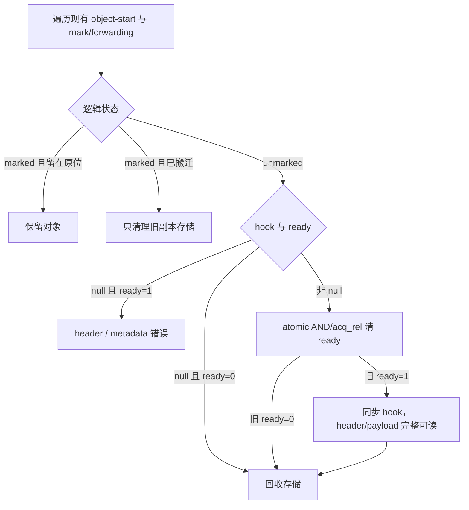

# M24 GC-free release hook 设计

状态：实现中。共同 ABI、runtime 回收、源码 hook、参数自由及泛型跨 Cone 消费已落地；其余表示组合、产物检查和最终全量验收仍在推进。

日期：2026-10-03（按 M23 总验收后的实现重新核对）。

基线：`f61e25df5`；M15 moving GC、M19 构造、M23-11 正式 CLI 与多 Cone 产物、M25 异常 ABI

规范依据：[语言规范 9.1.6、13.2～13.3](../specs/SCOOP-SPEC.md)、[runtime 规范 2.1～2.2、3.8](../specs/SCOOP-RUNTIME-SPEC.md)、[实现规范 2.1～2.6、2.11](../specs/SCOOP-IMPL-SPEC.md)。本设计替代 2026-09-07 版本；旧版本的重复 effect/布局验证、template-support 来源证明、整组 ODR 等同要求与手抄 ABI 摘要不再作为实现要求。

## 0. 目标、范围与现有基础

M24 让普通 final class 用 `release { ... }` 兜底释放 native resource。对象完整构造后置 ready；正常 GC 判断其逻辑死亡并真正回收存储时，先清 ready，再同步调用 exact TypeDescriptor 的静态 hook。hook 只能读取本对象的合格值字段，不取得 managed `this`，不分配、抛异常、挂起、进入 GC 或回调 Scoop。显式 close/release 仍负责及时释放。

完成门是实际源码经 `scoop build/run`、`.slib` 消费、artifact-only link 和 runtime GC 完成闭环。M24 不实现 ByteBuffer、StringBuilder、外部内存压力记账、finalizer、对象复活、异步清理队列、公开 arm/disarm 或通用 effect/ownership 框架。

当前可直接复用的基础及必须修改的位置：

| 当前实现 | M24 的直接改动 |
| --- | --- |
| `compiler/parser/src/decl/nominals.rs`、`compiler/ast/src/declarations.rs` | 独立 release member；保持普通 identifier 与 member 恢复边界 |
| `compiler/hir-lower/src/effects/`、共有 callable/nominal 接口 | 在现有 NoGc 分析中推导 release-call effect 与值类型条件 |
| `compiler/mir-lower/src/body/imported_calls.rs` 的 `ClassInitializer`、共有 `ClassNew` | 在分配并调用最外层 initializer 的正常出口发布 ready |
| `compiler/lir-lower/src/function/call/`、`compiler/codegen/src/function/call/native.rs` | release 的直接 C call 不进入普通 native-safe；合格 helper 保持原机器 body |
| `runtime/src/gc/reclamation.c` 的 small/large finish | 用 mark/forwarding 区分死亡对象与搬迁旧副本，在失效前调用 hook |
| `runtime/src/gc/evacuation.c` 的完整对象复制 | 保留 ready；不对旧副本执行 hook |
| 共有 TypeDescriptor、callable registration、ODR 与 `.slib` reader | 增加 policy/引用并沿现有格式、ABI、链接与加载边界检查 |
| [Python fixture schema 1](../../tests/fixture_runner/README.md) | 新增真实源码、native companion、CLI 步骤与 normal/stress 变体 |

基线尚无 release 语法、policy、ready bit 或 hook 实现；只有 `OdrMemberRole::ReleaseHook = 16` 已预留且仍被物理目录拒绝。现有 `@NoGC` 不等于 release-safe：其中可能包含 C extern/native transition、TLS 或 GC handle 操作。现有 reclaim 中 `!keep` 同时覆盖死亡对象和搬迁旧副本，不能在该分支无条件调用 hook。

## 1. 源码规则

### 1.1 语法与示例

```text
release-block ::= "release" block
```

`release` 仅在 type body 的 member 起始位置、后接 block 时是 contextual keyword。普通 `fun release()`、变量和参数名保持合法。block 无名称、参数、返回类型、可见性、annotation 或 modifier；不进入函数查找、重载、覆写、dispatch 或 callable reference。每个合法 owner 至多一个，正常完成结果为 Unit。

```scoop
@Extern(name = "free")
fun nativeFree(address: Ptr<Unit>)

final class NativeOwner public constructor(
    private var allocation: Option<Ptr<Unit>>,
) {
    public fun close() {
        val owned = allocation
        allocation = None
        when (owned) {
            Some(value) -> @Unsafe { nativeFree(value) }
            None -> {}
        }
    }

    release {
        when (allocation) {
            Some(value) -> @Unsafe { nativeFree(value) }
            None -> {}
        }
    }
}
```

示例省略资源取得 API；构造方负责移交其拥有的 native allocation。`Ptr<Unit>` 对应 C `void *`，None 为 inert state。普通 close 中的 C 调用使用既有 native-safe 协议；release 中相同声明使用直接 native leaf call。

### 1.2 owner 与 reclaiming receiver

合法 owner 是普通、可实例化的 final class，包括默认 final、static nested 和 generic class。可以继承无 hook 基类并实现 interface。open/abstract/sealed class、interface、struct/enum/tuple、annotation class、object/companion、intrinsic 和 compiler-generated class 均排除；Throwable 继承闭包也排除，避免 M25 按值复制 exception payload 时复制资源所有权。带 hook 的 class 始终使用普通 GC heap 表示。

release 内没有普通 `this`。名字查询先沿普通局部作用域，再读取本 owner 自有的 backing field：

- primary property 与 body stored property 可读，custom getter 不执行；primary 非 property 参数、inherited、computed 和 delegated property 不能作为 release 字段读取。
- 读出的值为副本；可进行值投影、解构、local 更新和允许的运算。源字段写入、复合赋值、更新、取址和可写 place 均非法。
- `this`/`super`、源对象的 method/accessor/extension 调用，以及源对象传参、返回、捕获、装箱、转换、比较、取址或发布均非法。局部同名值遮蔽字段时，不提供另一个 receiver 语法绕过遮蔽。
- 读取 managed 字段非法；对象仍可保存不被 release 读取的 managed 字段，GC 继续按普通 scan 描述追踪它们。

`return`、`throw`、`try`、suspend、lambda/匿名函数/局部 fun 声明与函数引用在 block 中非法。普通 if/when/while、break/continue 和值绑定沿用已有规则，受第 1.4 节限制。helper 自己的正常函数 return 不受 block 的 Unit 出口限制。

### 1.3 `ReleaseValue` 与泛型条件

`ReleaseValue(T)` 是编译器已有类型事实的补充，不是公开 trait 或 annotation：

1. exact T 必须 GC-free。
2. 按真实表示递归排除已解析 compiler protocol 中的 PinnedPtr、GcHandle、FunPtr、ForeignCallback；struct/tuple 的所有字段、enum 的所有 variant 都要满足。
3. Ptr<Unit> 合法；Ptr<T> 还要求 pointee T 满足同一条件。Option 与透明 alias 复用真实表示，不产生另一套规则。

只约束实际参与表示或执行的类型参数。phantom 参数不因名字出现在 application 中而受限；`sizeOf<T>()` 等纯布局查询不产生运行时 T 值。合法指针递归按有限 typed 图求固定点；回访节点不是递归值布局错误，也不能使用深度/实例数预算替代判定。

对 generic release template，字段/局部/调用所需条件在定义处推导成 `RequiresReleaseValue`，再沿原类型替换和调用关系传播。ref bound 与条件直接矛盾时在定义处诊断；其余闭合 application 即使只出现在签名、别名、父类型或字段中也要检查。`Owner<T>` 仅持有与 T 无关的 native handle，而 release 不读取 T 字段时，T 可以是引用类型。

类型规则不证明 raw address 的来源或 ownership。通过 integer/Ptr<Unit>/native 实现隐藏 GC heap 地址、恢复 managed receiver 或访问失效资源仍违反 unsafe/FFI 契约；本里程碑不增加地址来源证书、线性资源类型或通用指针追踪。

### 1.4 effect、默认参数与 native 调用

release 的所有运行时值都满足 ReleaseValue；callee 的既有 NoGc 合同只是必要条件。名称查找、重载选择和完整实参展开先完成，再检查实际操作，不能因为 effect 不合格改选另一个候选。

| 操作 | 规则 |
| --- | --- |
| 标量、值聚合、Option/match、raw pointer intrinsic | 按既有 typed 操作；所有值合格，unsafe 要求保留 |
| 值 primary construction / enum assembly | 合格值的直接组装，不制造 managed 对象 |
| Scoop helper | 实际 Scoop 正文、NoGc、静态目标，且推导为传递 NoTransition；使用原 body |
| 值 method/accessor/secondary constructor、扩展函数、已有纯存储 accessor | 与其他静态 helper 同一规则；未形成既有 NoGc 合同的声明不自动升级 |
| release block 直接 C ABI extern | 显式 Unsafe；签名 C-FFI-safe 且值合格；直接 native ABI 或原纯 storage bridge |
| helper 内的 C extern 函数调用，或任意 Scoop ABI extern 调用 | 不合格；前者的原机器 body 含普通 outbound transition |
| dynamic/interface/indirect call、managed allocation/ref、boxing、String/Array、捕获环境 | 不合格 |
| root/handle/pin/thread/GC runtime 操作、初始化 ensure、TLS | 不合格，即使其已有 GcEffect 为 NoGc |
| 非 TLS 的 GC-free const/raw/native global、无 ensure 的合格普通存储 accessor | 沿原可见性、unsafe、表示和数据竞争规则；不得隐藏初始化或 TLS bridge |

默认参数在 caller 求值，不能只检查显式实参或目标签名；默认值不反过来污染 helper 本身的正文 effect。operator、accessor、componentN、for 和 vararg 展开后的每个调用、temporary 和分配也要检查。当前整数 `/`、`%` 可能抛 ArithmeticException，release 中拒绝运行期使用，即使处于非零 guard 或除数是 literal；已有 const 求值的结果可用。不新增路径证明、循环次数限制或时间预算。

既有 override effect 一致性规则仍适用：普通 `Iterator.next` 实现保留接口的 MayGc 合同，不能仅将其中一个 override 改标 NoGc 来供 release 使用。采用该合同的 `for` 展开会在实际 next 调用处被拒绝；手写允许的值操作和 `while` 遵守同一 effect 检查。

release block 不是 NoGc annotation target，也不新增 `@ReleaseSafe`。Unsafe/Safe 嵌套规则保持。对直接 C leaf，调用者负责保证实现不展开异常、不回调任何 Scoop entry、不进入 GC/root/handle/pin/thread runtime、不保留临时地址、不等待已停顿的 mutator 或依赖其进展。C 函数指针签名、Extern 拼写、LLVM nounwind 和 undefined-symbol 检查都不能证明这些运行时行为；这是普通 unsafe native 契约。

## 2. 生命周期与 GC

### 2.1 构造成功才发布

生成顺序固定为：完整实参求值 → 分配 exact 对象且 ready=0 → 调用选定 initializer → 正常边 reload receiver → PublishReleaseReady → 返回对象值。

PublishReleaseReady 使用 header 上的 atomic OR/release，保留其他 GC 位，不产生 safepoint。它位于构造表达式的正常结果路径，不放进 primary/secondary initializer：同一 initializer 可能是外层构造，也可能被 this/super delegation 调用。所有本地、依赖和 generic 构造共用该位置；普通返回 class 的函数不是构造，不发布。

InitializingThis 的既有规则阻止半初始化 receiver 逃逸。任一 constructor/delegation/init 失败均不发布；已取得的 native resource 由构造代码或调用方显式清理，不增加失败回滚 hook。构造中另行成功创建的子对象有自己的 ready 与生命周期，外层失败不撤销它。初始化期间和 initializer 返回前发生 moving GC 时，publish 必须使用正常 root 协议 reload 后的 receiver。

ready 表示完整构造，永不表示“当前拥有资源”。惰性取得资源的对象可先以 None 构造并发布，后来写入 handle；显式 close 也不清 ready，只先置 inert state 再释放旧 handle。若该对象以后死亡，block 可以执行，但清理资源的分支成为 no-op。

### 2.2 逻辑死亡与存储失效



`runtime/src/gc/reclamation.c` 的 finish_small_block/finish_large_block 仍遍历当前 side metadata。每个 object 先分类：marked 且未搬迁为 LiveInPlace；marked 且确有 forwarding 为 RelocatedCopy；unmarked 才是 Dead。`moved` 在当前代码中由 source block/pin 推导，对未标记对象也可能为 true，所以不能只判断 moved 或 !keep。

仅 Dead 进入一个共有的 release-before-reclaim helper。non-null hook 使用 atomic clear-and-test，旧 ready=1 才调用；ready 本身承担至多一次语义，不加 claimed state、payload copy、队列或另一次堆遍历。hook 返回前不改 object-start、exact size、header/field bytes；返回后才能 poison/复用/退役。空 hook 且 ready=1 是局部 invariant error，不能先清位再静默跳过。

small、large、普通 free-run、partial pinned source、整块 quarantine/unmap 使用同一规则。block 级 release/quarantine 只在该块全部逐对象处理完成后执行，不能直接触发对象 hook。from-space 旧副本始终不调用；evacuation 的完整 memcpy 保留 to-space header 和 ready。

### 2.3 锁、可见性与退出

当前 collector 在 `scoop_gc_collect_internal` 中持有 heap/root 锁，在恢复 world 前完成 reclaim；M24 在该既有上下文同步调用 hook。hook 不能重新取得这些运行时锁或请求 transition/GC。native allocator 自身的同步可用，但不得形成对停顿线程的等待环。

构造 publish 与 collector claim 的 release/acquire 配对保证初始字段可见。后续字段更新由语言的数据竞争规则和已有 STW handshake 保证；显式 close 在 mutator park 前完成的 inert 写入必须可见。M24 不提供并发 close 的额外线性化或不同 owner 的 handle 去重。

best effort 只放宽调度：不保证再次 GC、调用顺序、执行线程、release 成功或退出时运行；正常 collection 已决定回收 ready 对象时不能跳过调用。abort、native fault、foreign unwind 或不返回的 hook 不具备恢复/重试保证。shutdown 不做最后一次 GC 或补遍历；需要及时归还的 fd、锁、事务和 flush 仍在普通控制流中完成。

## 3. 编译器与共有数据

### 3.1 HIR 一次推导，接口传递结果

在现有 `hir-lower/effects` 上增加两项局部分析，不建立通用 effect solver：

- ReleaseValue 使用现有具体类型、字段/variant、intrinsic/protocol 与泛型条件查询；在同次类型图中缓存结果。
- NoGc callable 的定义方推导 `ReleaseCallability`。先检查本地操作并收集已有 typed direct-call edge，再在 SCC 中传播不可用状态和实参替换后的条件；递归 helper 的 SCC 若只含合法操作可以成立，无需循环执行预算。

```text
ReleaseCallability = Unavailable
                   | NoTransition { requirements: RequiresReleaseValue[] }

ReleasePolicy<HookRef> = None
                      | SynchronousGcFree { hook: HookRef }
```

Unavailable 是合法普通 callable 的属性，只有从 release 使用时才报错，不改变既有 NoGc 程序。NoTransition 是推导结果，不是用户 annotation 或来源资格。摘要放入已有 `CallableSourceEffectsV1` 对应的版本化记录；泛型条件复用实际 binder 的 typed ID，不按参数名称匹配。Export HIR 推导使用 `TypeParamId`，共有 effect 中使用现有 signature binder frame 的 depth/index；读入时只在原 binder scope 边界检查引用。它不进入 callable declaration identity、重载签名、Scoop ABI 或 override/slot 相容性规则；它描述被直接选中的实际实现。正文变化改变接口/产物 fingerprint。

参数自由依赖 helper 直接沿共有 callable 接口与真实 provider 选择，消费方不复制其源码/机器正文，也不重新遍历其调用图。generic helper 在正常具体化时消解已导出的条件，复用完成替换的正文与同次检查结果。reader 只验证该数据的格式、引用、合法 kind 与相邻机器绑定；不在 HIR/MIR/LIR meta crate 另写 effect 语义实现。

### 3.2 hook 身份和 owner policy

AST 是独立 ReleaseBlock。Export HIR 和 LocalConcrete 使用不同 typed hook ID；MIR、LIR 也有各自 ID。全局 machine identity 统一用第 4.2 节的 PersistentCallableBodyId，不增加 PersistentReleaseHookId 或新的 mangler kind。 各 stage 可复用普通 callable 的 CFG / 机器代码存储结构，但 hook 必须保存在自己的 typed arena 中，不能分配普通 FunctionId；local-value 的实际 owner 也保留 Function / ReleaseHook 的封闭区分。

release 的 source context 复用 owner 的 nominal context；它没有函数声明，不增加另一种 lexical callable parent。其局部值复用原 definition path/selector 和 `PersistentLocalValueId`；具体化后，local-value materialization 的 `CallableTemplateOwner` 使用 tag 7 `ReleaseHook(owner_exact_type_id)`，context 为 `NoSubstitution`，因为 owner 已含全部具体类型实参。普通 callable 的编码保持不变，不把 release 伪装成函数、构造器或初始化单元。

共有 nominal 声明承载 release template/policy。wire 以原 nominal owner 为键内联完整 typed template 与条件，不保存进程内 arena 序号。字段引用保存 PersistentFieldId 及原 owner/type；template 的 private/internal helper、native contract 和所需类型走现有支持声明闭包，不公开到普通 lookup，也不需要 template-support 授权记录。

具体存储复用共有 nominal 声明与泛型 nominal 执行模板：声明 details 保存 policy 和 binder 条件；既有 generic initialization record 增加必需的 release policy 字段，`SynchronousGcFree` 分支保存独立 hook 的 definition origin 和无结果的通用正文 fragment。该 fragment 没有 constructor receiver 或参数输入，不属于任一 constructor。reader 在原声明/模板连接边界检查 policy 一致；来源、字段、helper 与 native 引用继续使用现有 fragment visitor 和支持闭包。导入时恢复一次 nominal binder 域中的 Export hook，再由实际 exact type 具体化；不复制为外来源码 class 或普通 callable。

LocalConcrete 明确区分本次物化 hook 与依赖 owner 的 hook 引用；只有前者携带完整本地 body。参数自由外来类型的构造只消费 policy，不能为取得一个 ConcreteReleaseHookId 而重建外来 body。generic exact application 由正常物化队列产生完整 hook、条件结果与引用；没有残留 binder 或“以后再检查”标志。仅类型用途的条件检查不额外物化 TD/hook；一旦按既有规则发射带 release policy 的 TD，其 hook 与 registration 才必须随实际引用闭合。

### 3.3 MIR 与 LIR

MIR 的 release body 没有普通参数，raw reclaiming input 只由后端私有 ABI 提供。`ReleaseFieldLoad` 是读取源对象的唯一操作；值运算、局部存储、调用和 CFG 复用已有存储与 lowering，正文保存在独立 hook arena。MIR 输出边界复用普通 CFG/值操作校验，再检查本次 hook 的受限操作、静态 NoGc/C 目标以及字段 owner，不重跑 HIR effect 推导。实际正文不能含 managed receiver、barrier、异常边、throw、suspend 或 root API。block 正常结果为 Unit，普通 helper 保留原函数返回类型。

普通构造的 PublishReleaseReady 引用完整 exact class owner/policy 与当前 receiver；外来 owner 使用真实 typed 引用，不依赖本地 hook arena。MIR 输出边界检查本次 CFG 的正常/异常边、引用和类型，不能把既有完整 MIR 再送过第二条发布验证管线。

共有 MIR class representation 保存 `None | SynchronousGcFree { owner_exact_type_id }`；这里的 typed exact owner 是唯一 hook 的语义引用，LIR 按 callable-body v2 tag 5 派生机器 body id。reader 在原 type bridge 边界检查 owner 等于该 class 的 exact id、class 为 final，并把 policy 与已读 nominal 声明对应起来。TD 投影直接消费这份 policy，不能只因 LIR foundation 中偶然存在某个 hook body 就给类型补上 policy。

LIR 一次完成静态字段 offset/alignment、值表示、helper ABI 和 native storage ABI。ZST field 产生 exact typed 零 payload 值，不读取伪造的 offset；大值按已有 aggregate 规则处理。reclaiming receiver 为 AS0 私有参数，禁止把它转换为 AS1 或作为普通源语言值使用。

release callsite 只有两种：带已有 local/external typed target 的 ReleaseSafeScoopCall，以及保留原 NativeExternalContractRecord 的 ReleaseNativeLeafCall。C storage bridge 使用普通生成单元，transition 本来属于 caller，release 不为 bridge/NoGc helper 克隆第二份正文。非 TLS native global 的纯存储访问在 release 与普通 NoGc 正文中明确使用 NoTransition，其他访问保留 NativeSafe；LIR 用封闭 sum 配对各自的 safepoint/root plan。已有纯 memory-copy target support 可用，TLS/bootstrap、runtime transition 和 managed helper 不可用。

外来 C extern 的普通 Scoop 入口含 outbound transition，不能作为 release helper 使用。依赖选择保留该声明已验证的 source native contract；release 内的实际直接调用将它投影到 MIR 既有 extern arena，再沿上述 native leaf 路径发射。普通调用仍引用 provider 的 Scoop 入口，不复制该入口或重新建立外来函数声明身份。

共有 HIR dependency call site 的实际目标分支增加 `NativeLeaf`（tag 3），只用于 release root 下的直接 C 声明。HIR 引用边界检查该 kind、原声明和完整实参/结果；MIR 的 Scoop 入口连接不要求此分支再选择 provider wrapper，native ABI 和实际 symbol 继续由既有 LIR/native contract 边界检查。仅由 leaf 使用的声明不保留未使用的 Scoop entry，混合普通/leaf 使用则各自引用实际入口。

LIR 对本次新增的机器 body 检查无 managed value、statepoint、poll、root、EH 和 transition，保留必要 ABI/引用检查；不重算依赖的 ReleaseValue 或完整 release-call graph。codegen 机械发射 nounwind、address-significant 的 `void (ptr addrspace(0))` thunk，LLVM 不挂 GC strategy，不加入口/回边 poll、stackmap、personality 或 LSDA。

## 4. TypeDescriptor、身份与产物

### 4.1 TypeDescriptor 和 ready bit

C header 保持 16 bytes，gc_word 在 offset 8。新增 bit 2（数值 4），pin bit 1 不变；mutator 源码和公开 FFI 不获得读写入口。C runtime 沿当前 `__atomic` header 操作实现 claim，LLVM 发布使用同宽同对齐的 atomicrmw OR/release。

TypeDescriptor 在旧固定部分末尾、related_types 尾表之前追加：

```c
typedef void (*ScoopReleaseHookV1)(void *object_start);
/* The field precedes the flexible related_types array. */
ScoopReleaseHookV1 release_hook;
```

Darwin/AArch64 上 hook offset 为 144，固定部分及 related_types 起点为 152，alignment 仍为 8。其他字段次序、对象 payload layout、scan 和八类 prefixed record 的 size 不变。所有 TD 都有此字段；None 编码为 null，SynchronousGcFree 编码为实际 thunk 指针。只有允许的普通 final class FixedObject TD 可非空；value box、array/String、function/closure、coroutine、exception、object 等保持 None。

C/LLVM 布局测试覆盖 sizeof/offsetof、尾表起点及零/非零 policy。runtime 只按注册后的 TD 读取该字段，不能按诊断名称、字段形状或 FQN 查找 hook。

### 4.2 machine identity、Strong 与 ODR

```text
CallableBodyKeyV2 =
    Strong { owner }                                    // tag 1
  | Odr { member }                                      // tag 2
  | RootGateway { root_cone, main_body_id }              // tag 3
  | InitializationStartupGateway { unit_id }            // tag 4
  | ReleaseHook { owner_exact_type_id }                 // tag 5

PersistentCallableBodyId =
    SHA256(ByteSpan("scoop-callable-body-v2") || RuntimeEncode(key))
```

RuntimeEncode 保持既有 ABI 1：tag 是 little-endian u32，typed ID 为固定 32 bytes，product 按声明序，不改用 Wire CBOR。所有 body 使用 v2 domain，不只切换新增 hook。declaration/exact type/callable application/ODR group identity 与 persistent-v1 mangler 保持，body 派生的 site/registration/member ID 全部重建。

参数自由 source class 的 hook 以其 exact type 得到 body id，跟随该 source subject 的 Strong 定义，由定义 Cone 发射一次；不造 ReleaseHook ODR member、不生成一份虚构普通 source function，也不复制外来 hook。

generic exact owner 使用现有 nominal specialization group。该 owner 的必要成员包括：一个 `ReleaseHook(16)/ExactType(owner)` primary `cb` body、一个 `RegistrationRecord/CallableBody(body)` 的 `cr` record，以及已有 TD/type registration。hook body id 仍由 ReleaseHook(owner) 产生；不再增加第二个 CallableBody role primary、`od` primary 或 safepoint/sr。helper 若有自己的普通或 generic owner，继续属于自己的定义/group。

多个 Cone 物化同一 owner 时，共有成员按既有 ABI/definition 判等并 coalesce 到同一地址；独立成员取并集，不要求整组成员集合相同。TD 的实际 hook relocation 必须命中该 owner 的 cb。普通 Strong 和 ODR 的引用、符号及加载规则足够，不增加 hidden 来源资格或签名证明链。

C bridge 引用按已有 GeneratedBridgeSemanticTarget/unit 正规化。producer-local atom 地址或 ID 不进入 generic hook 的 canonical definition；不同 consumer 使用同一 native contract 时应产生相同语义目标。源码/接口摘要包含 release body、字段/调用和条件；canonical LIR/对象摘要包含实际 policy、body、offset/ABI 和 relocation。修改 body、字段类型、helper effect 或 policy 会使相关产物和消费缓存失效。

### 4.3 版本迁移

以下是相对本设计基线的 M24 目标版本；共同版本、TD 布局和 body identity 已按此表迁移。版本变化只落在现有容器、section、profile 和 ABI 上，不建立 release 专用格式或兼容 reader。

| 项目 | M23 基线 | M24 |
| --- | --- | --- |
| deterministic-ar / bootstrap manifest | 1 / 1 | 保持 |
| persistent identity / Wire CBOR / hash framing / mangler / RuntimeEncode | 1 | 保持 |
| HIR/MIR/LIR outer schema | 1/1/1 | 2/2/2 |
| HIR/MIR/LIR identity-foundation | /3、/1、/2 | /4、/2、/3 |
| HIR cross-cone-interface | /44 | /45：nominal release template、callable effect/条件 |
| HIR cross-cone-type-semantics | /12 | /13：ReleaseValue 的实际类型事实 |
| MIR cross-cone-type-bridge | /6 | /7：exact class release policy 与实际 hook 引用 |
| LIR cross-cone-layout-abi | /5 | /6：descriptor policy 与 hook ABI 关联 |
| LIR cone-production / strong-production | /4、/16 | /5、/17：实际 release body、TD 与注册 |
| manifest single-cone-production | /2 | /3：物理 ODR 目录允许 ReleaseHook role |
| LIR cross-cone-layout-link-closure / link-identity-closure | /4、/9 | /5、/10：hook 定义和实际 relocation 关系 |
| link-object scoop-lir | /4 | /5：新 TD/body 的物理格式与引用 |
| link-object generated-c-bridge | /1 | 保持：复用原纯 bridge |
| cross-cone-generic profile | /2 | /3，正式 CLI 使用该完整生产路径 |
| 仍保留的 single-cone-strong / cross-cone-semantics-strong profile | /3、/3 | /4、/4，同步其 required inventory，不扩张原子集 |
| 八种 runtime metadata record prefix ABI | 3 | 保持 3 |
| TD 固定部分 / callable-body schema | 144 bytes / 1 | 152 bytes / 2 |

未改变格式的 core-bootstrap、普通 callable bridge、native contract 和 link-support 不因本表批量升代；它们的引用值及所属 profile fingerprint 仍自然更新。新增 field/tag 使用所属 wire 定义中未使用的编号，在同批 producer/reader/golden 中锁定，退役编号不复用。旧版本、混合 outer、旧 required capability、body-v1 或 runtime ABI 不相容均要求重建，不补默认 None。

当前 encoder 的 ABI 输入为：

| 输入 | M23 实际 CBOR | M24 CBOR |
| --- | --- | --- |
| LanguageAbiContract | `a10101` | `a10102` |
| RuntimeAbiContract | `a3010302010301` | `a3010402010302` |

runtime contract 的 field 1 从现有 revision 3 升到 4，覆盖 ready/reclaim 与新 TD；field 2 保持 1，field 3 改为 release-hook TD contract 2。field 2 不是 metadata prefix ABI，不能套用旧设计的 `a3010202030302`。composite identity-ABI descriptor 的 field 6 和 11～13 取 2，其余未变字段保持；沿既有 hash domain 和共有 encoder 生成向量。不要把旧 M24 文档的 fingerprint 常量搬进实现。

compiler、core、provider/consumer、runtime 对象索引与 cache 同批重建。profile major、outer schema、record ABI 和 runtime fingerprint 各自检查对应契约，不能互相替代。普通 source hash、产物摘要和工具配置负责失效，不另加 release 缓存或重建资格机制。

### 4.4 验证分工

| 边界 | 本次负责的检查 |
| --- | --- |
| HIR frontend | owner、字段/访问、完整语法展开、ReleaseValue、泛型条件和 effect 推导 |
| MIR/LIR output | 本次生成 CFG、typed 引用、publish 正常出口、物理类型/ABI 和受限操作 |
| `.slib` reader / object reader | 新输入的格式、owner/ref、实际 body/TD/registration、offset/relocation 和既有摘要关系 |
| artifact-only link | 实际 provider/native symbol、共同 ODR member 的定义与最终地址；无源码/前端重放 |
| runtime registry | 加载后的 FixedObject、可执行 entry、owner 对应 body id 和地址、既有重复登记规则 |
| reclaim | 已有逻辑死亡分类、一次 ready clear/test、同步调用与存储失效顺序 |

runtime 用 type registration 的 exact ID 与 body-v2 tag 5 得到预期 hook body id，在已有 callable map 中匹配 entry；不重建 source final/Throwable 关系或重算 LIR/ObjectDefinition/调用图摘要。空 hook 的合法 shape 与 source policy 在其各自边界一次确定。

对象 verifier 继续校验产生的 relocation、unwind/stackmap 归属和 typed native/target-support requirement；机器属性的正向/negative artifact 测试发现 codegen 回归。它不对任意 C 机器码执行通用 GC-free/回调证明。Compile/Link、发布和 GC 热路径复用已完成且未变化的结果，不添加独立证书、凭证状态机或重复完整 reader。

## 5. 诊断与测试

### 5.1 negative fixture

每项通过正式 CLI 断言 primary source/span、message 和必要 note；语言错误不留到 MIR/codegen 报 unsupported。

| 规则组 | 必须覆盖的错误 |
| --- | --- |
| 语法/owner | modifier/annotation/参数/返回类型；重复 block；所有排除 owner；间接 Throwable 子类；普通 fun release 的正向对照 |
| receiver/field | this/super、inherited/computed/delegated/primary 非 property 参数、managed 字段；写/更新/取址/捕获与源对象逃逸 |
| ReleaseValue | GC handle/pin/callback/FunPtr 的直接、Option、aggregate、pointer 包装；合法指针递归的正向对照；phantom 参数不误拒 |
| generic | ref bound 不可能条件；构造和仅签名/别名/字段 application 的不满足条件；跨 Cone 条件传播 |
| effect | managed/间接/接口调用，throw/try/suspend/局部 callable，NoGc helper 的直接/间接 C extern、TLS 或 runtime 操作 |
| 隐式操作 | 默认参数分配、operator/accessor/componentN、for/vararg 展开的 managed 操作；guard 内运行期除法仍报错 |
| unsafe/native | 缺 Unsafe、Safe 嵌套、Scoop ABI extern、非 C-safe 参数/结果、native TLS bridge |
| artifact | 旧/混合版本、未知 tag、错误 owner/字段/ABI、TD hook relocation、body/registration 缺失、错误 role/discriminator、共同 ODR 定义冲突 |

调用错误主位置是 release 内实际调用；callee 声明和默认值原定义位置作为已有 note。依赖方错误仍引用真实 provider canonical source，不能要求恢复本地 provider 源文件。

### 5.2 独立与组合 fixture

在 `tests/fixtures/m24-release-effects/` 与 `tests/fixtures/m24-release-blocks/` 使用 schema 1 数据，按 source、lifecycle、dependencies、native 等自然内容分组；不增加专用 runner 分支。AST、Export/LocalConcrete HIR、MIR、LIR golden 锁定 field identity、effect/条件、owner policy、成功边 publish、hook body 和真实调用目标。

| 验收主题 | 正向与组合证据 |
| --- | --- |
| native owner | fd integer、Option<Ptr<Unit>>、GC-free aggregate；empty block；custom getter 被绕过；local 遮蔽；Unit/ZST 字段 |
| 显式关闭 | close 先置 inert；重复 close；之后 GC 可运行 block 但资源计数不再增加；构造后惰性取得资源 |
| 构造 | primary、this 链、base、body init 和跨 Cone constructor；成功恰好一次 publish，各失败位置不 publish；成功子对象独立回收 |
| receiver relocation | initializer 中分配/GC，正常返回后对新地址 publish；含引用字段仍完整扫描和更新 |
| roots | 栈/global、GcHandle、pin、native caller/root、closure/coroutine 保存 owner 时保活；解除后回收 |
| reclaim 路径 | small/large、非 source 死对象、source 中死对象、moving live 旧副本、partial pinned block、poison、整块 quarantine |
| 次数/顺序 | 多次 GC、循环引用中的多个 owner，各逻辑对象至多一次；测试不依赖地址、遍历顺序或 malloc 复用 |
| helper | 本地/外来/泛型 NoGc helper；正常递归 SCC；值 accessor/constructor；默认值只在 caller 按实际参数检查 |
| native ABI | 直接 leaf、已有 aggregate storage bridge、普通/释放调用共用 extern；C 返回的资源状态仍按声明处理 |
| 多 Cone | A 发布参数自由 owner、B 构造/再发布、C 仅凭产物使用；private 支持引用和 re-export；移走源码后独立进程 link/run |
| generic/ODR | 两 consumer 的同 exact owner 得到同一 TD/hook；不同实参区分；独立 method/helper 成员可不同，共同 hook 内容必须相同 |
| 缓存/版本 | 更新 release body/字段/helper effect 使实际下游重建；未变输入命中；旧 core/provider/runtime 与新消费方明确不兼容 |
| shutdown | 保持 owner live 到 main 结束，程序退出不补调；runtime 状态销毁不变 |

native companion 使用原子计数和明确有效期的测试资源，由 fixture 的 cc/ar 步骤构建，再通过 `--library-path` 传入。只向 hook 返回已经取得的 native handle，不把待回收 managed object 地址暴露给 C 测试。需要验证 header/poison 顺序的内部测试放在 runtime 的真实 reclaim 路径中。

runtime 内部测试额外覆盖 null/ready 四种组合、clear-before-call、位与 pin 的互不破坏、small/large 的 source 分类，以及 C/LLVM 144→152 布局。错误组合可通过局部损坏输入触发，不增加生产用造假工厂或来源状态机。

shutdown 的计数断言须发生在 runtime 返回/销毁后，例如复用现有 runtime C harness 或 companion 的纯 native atexit 检查；仅检查 main 返回前的输出不足以覆盖退出时行为。

normal 与 `SCOOP_GC_STRESS_MOVE=1` 使用同一正式 binary/启动协议；要求发生指定 collection 的 case 显式调用现有 gcCollect，并在短作用域或函数返回后消除活跃根。机器产物断言 release thunk 没有 statepoint、GC strategy、LSDA/personality、AS1 值或 transition；普通 EH/CFI 属于其他函数时不得把整个对象文件错误拒绝。

## 6. 实现顺序与完成门

按可运行闭环推进，不先搭一个无人使用的 release framework：

1. **共同数据与 ABI 基线**：落实第 4.3 节、TD null 字段和新 body schema；全部现有无 hook 程序经正式 CLI 重建运行。writer/reader/runtime 同批变更，验证旧格式拒绝。
2. **最小资源释放闭环**：普通 final owner + Option native handle + 直接 C leaf，接通 parser/HIR/MIR/LIR/codegen、构造 ready、small/large reclaim 与普通/moving 运行；同时完成显式 close、失败构造和旧副本不释放。
3. **完整源码子集与参数自由依赖**：补齐 ReleaseValue、现有 NoGc helper 分析/摘要、全部隐式调用规则、诊断及 A→B→C 参数自由 owner/helper 消费；每项都有独立与组合 fixture。
4. **泛型与所有实际表示**：接入共有模板实例化、签名用途条件、ODR role 16、值/ZST/大值/native bridge；完成两 consumer、再发布、artifact-only link 和 stress 组合。
5. **总验收与收口**：运行必要内部/布局/损坏测试和完整公共 suite，检查依赖、缓存、shutdown；删除临时双轨 reader、测试绕路和重复验证，更新完成状态与实际验收记录。

各批 Rust 变更先 `cargo fmt --all` 和 `cargo clippy --workspace --all-targets`，再运行相关测试；有 Python 变更时先按 AGENTS.md 使用固定 Ruff format/check。最终至少执行：

```sh
cargo test --workspace
cargo build -p scoop -p scoopc -p scoop-linker --bins
python3 -m unittest discover -s tests/fixture_runner/tests
python3 tests/run_fixtures.py --all
```

runtime C 布局/GC 测试沿现有 harness 执行；M24 fixture 声明正常与必要 stress 变体。完成必须同时有：正式源码运行、依赖产物独立消费/链接、构造成功恰好发布、失败不发布、旧副本不调用、Dead ready 对象失效前至多且必须尝试一次、实际 helper/native 路径符合契约、全部 negative/golden 与既有回归通过。设计完成不等于实现或验收完成。

## 7. 后续边界

M26 可以用该 hook 为 off-heap ByteBuffer 兜底，但仍须自行设计容量增长、失败原子性、borrow/view、字符/字节互转、显式 close 和外部内存压力反馈。若需要从 hook 扣减外部内存计数，只能在 M26 增加不请求 GC 的具体 native 操作；M24 不预建记账、配额或通用 release API。

full finalizer、对象复活、weak/phantom reference、异步 cleaner、线程亲和执行器、公开 arm/disarm、RAII/defer/using、自动 close 及 parallel/concurrent/generational GC 都不属于本里程碑。
